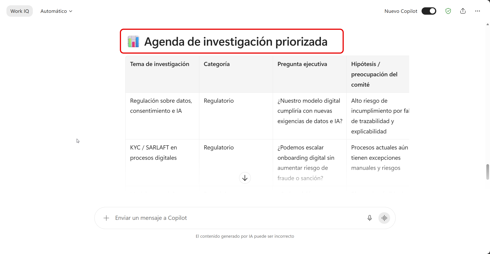
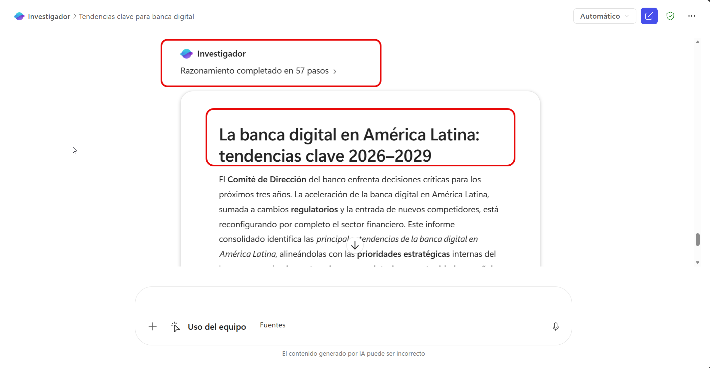
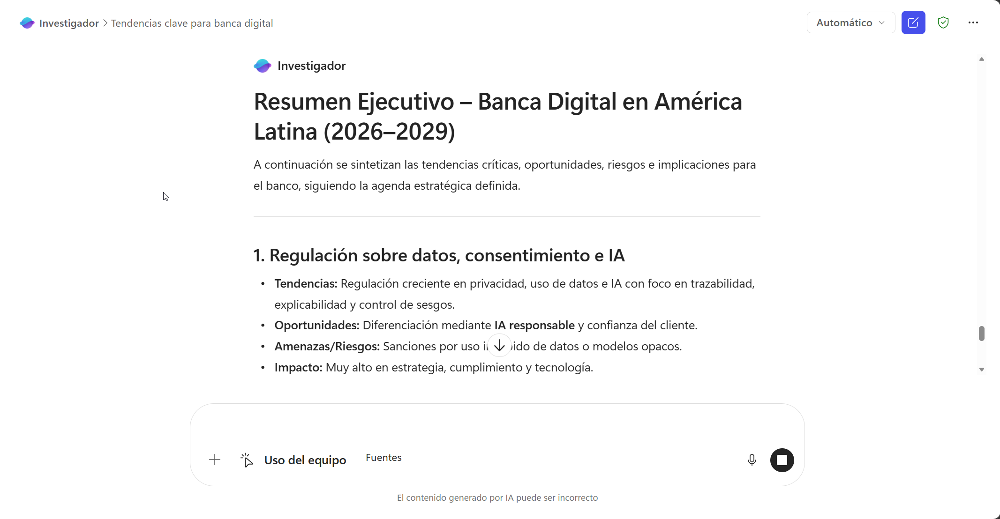
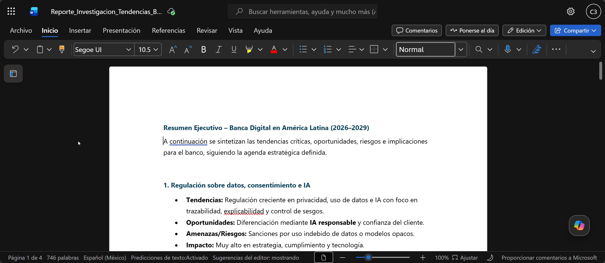

# Demostración 1. Definir el marco ejecutivo e investigar tendencias con Copilot Chat y Agente Investigador

## Objetivo de la práctica:
Al finalizar la práctica, serás capaz de:
- Usar Microsoft 365 Copilot Chat para definir los factores que debe analizar un Comité de Dirección ante nuevas regulaciones y tendencias de banca digital.
- Organizar preguntas estratégicas en categorías regulatorias, tecnológicas, financieras, operativas y de negocio.
- Utilizar el Agente Investigador para generar un reporte consolidado sobre tendencias de banca digital en América Latina.

## Duración aproximada:
- 20 minutos.

## Tabla de ayuda:
| Elemento | Valor de referencia | Observaciones |
| --- | --- | --- |
| Aplicaciones principales | Microsoft 365 Copilot Chat, Agente Investigador | Usar cuenta corporativa con acceso a Copilot y agentes. |
| Modo inicial | Copilot Chat | Usar modo Trabajo o Web según disponibilidad del entorno. |
| Agente especializado | Investigador | Puede tardar varios minutos en generar el reporte. |
| Materiales sugeridos | `Brief_Contexto_Estrategico_Banco_Demo.docx`, `Radar_Tendencias_Banca_Digital_LATAM_Demo.docx`, `Marco_Regulatorio_Financiero_Digital_Demo.docx` | 

## Contexto de la demostración

El Comité de Dirección del banco necesita evaluar cómo una nueva regulación financiera y las tendencias emergentes de banca digital podrían afectar la estrategia del banco durante los próximos tres años. Antes de pedir un reporte de investigación, la dirección debe aclarar qué información necesita, qué categorías deben analizarse y qué preguntas estratégicas ayudarán a tomar decisiones.

## Instrucciones

### Tarea 1. Preparar el entorno y los documentos de contexto.

**Paso 1.** Abrir Microsoft 365 Copilot desde `https://m365.cloud.microsoft.com/`.

**Paso 2.** Confirmar que la sesión esté iniciada con la cuenta corporativa asignada.

**Paso 3.** Verificar que los documentos de apoyo estén disponibles en OneDrive o SharePoint:
- `Brief_Contexto_Estrategico_Banco_Demo.docx`
- `Radar_Tendencias_Banca_Digital_LATAM_Demo.docx`
- `Marco_Regulatorio_Financiero_Digital_Demo.docx`

>[!Nota]
> Explicar que los documentos son ficticios y sirven para orientar el análisis. El Agente Investigador puede combinar información de contexto interno con investigación externa, según la disponibilidad del entorno y las políticas del cliente.

---

### Tarea 2. Definir el marco de decisión y crear la agenda de investigación con Microsoft 365 Copilot Chat.

**Paso 1.** Abrir un nuevo chat en Microsoft 365 Copilot Chat.

**Paso 2.** Solicitar a Copilot que ayude a definir los factores que debe analizar el Comité de Dirección.

Prompt sugerido:

```text
Actúa como asesor estratégico para el Comité de Dirección de un banco. El comité necesita evaluar el impacto potencial de nuevas regulaciones financieras y tendencias emergentes de banca digital sobre la estrategia del banco para los próximos tres años.

Antes de investigar, ayúdame a definir qué factores debería analizar el comité para tomar una decisión informada.

Organiza la respuesta en estas categorías:
1. Factores estratégicos.
2. Factores regulatorios y de cumplimiento.
3. Factores tecnológicos.
4. Factores financieros.
5. Factores operativos.
6. Factores de experiencia de cliente.
7. Factores de riesgo y reputación.

Para cada categoría, incluye preguntas clave que debería responder el análisis.
```

**Paso 3.** Pedir a Copilot que convierta los factores anteriores en una agenda de investigación ejecutiva.

Prompt sugerido:

```text
Convierte los factores anteriores en una agenda de investigación para el Comité de Dirección.

La agenda debe servir como insumo directo para el Agente Investigador.

Prioriza los temas según:
- Impacto potencial para la estrategia del banco.
- Urgencia de análisis.
- Nivel de incertidumbre.
- Necesidad de monitoreo durante los próximos 12 meses.

Incluye una tabla con las columnas:
1. Tema de investigación.
2. Categoría.
3. Pregunta ejecutiva que debe responderse.
4. Hipótesis inicial o preocupación del comité.
5. Impacto esperado.
6. Urgencia.
7. Tipo de fuente sugerida.
8. Resultado esperado de la investigación.
```

**Paso 4.** Revisar la agenda generada y verificar que incluya temas relacionados con:

* Regulación financiera y digital.
* Inteligencia artificial y agentes.
* Experiencia de cliente.
* Pagos digitales.
* Gestión de riesgos.
* Ciberseguridad y resiliencia operativa.
* Competencia fintech y bancos digitales.
* Eficiencia operativa y sostenibilidad financiera.

**Paso 5.** Copiar la agenda generada por Copilot Chat en el portapapeles

> [!Nota]
> Esta agenda no es un entregable final. Es el insumo que guiará el trabajo del Agente Investigador en la siguiente tarea. La finalidad es evitar una investigación genérica y asegurar que el reporte responda a las preguntas estratégicas definidas por el Comité de Dirección.



---

### Tarea 3. Ejecutar investigación profunda con Agente Investigador usando la agenda creada.

**Paso 1.** En Microsoft 365 Copilot, abrir el agente **Investigador** desde el panel de navegación.

**Paso 2.** Adjuntar o referenciar los documentos de contexto cargados en OneDrive o SharePoint:

* `Brief_Contexto_Estrategico_Banco_Demo.docx`
* `Radar_Tendencias_Banca_Digital_LATAM_Demo.docx`
* `Marco_Regulatorio_Financiero_Digital_Demo.docx`

**Paso 3.** Pegar la agenda creada en la Tarea 2 dentro del prompt del Agente Investigador.

> [!Nota]
> Aquí se conecta explícitamente el trabajo de Copilot Chat con el Agente Investigador. La agenda creada previamente se usa como guía para definir alcance, categorías, preguntas ejecutivas y resultados esperados de la investigación.

Prompt sugerido:

```text
Actúa como investigador estratégico para el Comité de Dirección de un banco.

Usa la siguiente agenda de investigación como estructura principal del análisis:

[PEGAR AQUÍ LA AGENDA DE INVESTIGACIÓN GENERADA EN LA TAREA 2]

Con base en esa agenda, investiga las principales tendencias que están impactando la banca digital en América Latina y que podrían afectar la estrategia de una institución financiera grande durante los próximos tres años.

Incluye como mínimo:
1. Regulación financiera y digital.
2. Inteligencia artificial, IA generativa y agentes.
3. Experiencia de cliente y personalización.
4. Pagos digitales e interoperabilidad.
5. Gestión de riesgos, ciberseguridad y resiliencia operativa.
6. Competencia de fintech, bancos digitales y otros actores.
7. Eficiencia operativa y automatización.
8. Modelos de negocio emergentes.

Usa los documentos adjuntos como contexto interno del banco y complementa con investigación externa cuando esté disponible.

Para cada tema de la agenda, entrega:
- Hallazgos principales.
- Evidencia o referencia utilizada, si está disponible.
- Oportunidades para el banco.
- Amenazas o riesgos regulatorios.
- Impacto potencial para áreas estratégicas, regulatorias, tecnológicas, financieras y operativas.
- Preguntas que debería resolver el Comité de Dirección.
- Señales que deberían monitorearse durante los próximos 12 meses.

Entrega el resultado como un reporte ejecutivo consolidado.
```
**Paso 4.** Si el agente investigador genera preguntas, responderlas con base en la agenda y los documentos de contexto, para asegurar que el reporte final sea completo y útil para la toma de decisiones del Comité de Dirección.



> [!Nota]
> El Agente Investigador puede tardar varios minutos. Si el entorno no tiene el agente habilitado o el resultado tarda más de lo esperado, utilizar el archivo `Reporte_Investigacion_Fallback_Tendencias_Financieras.docx` para continuar la demostración.

**Paso 5.** Revisar el reporte generado y confirmar que responde a la agenda creada en la Tarea 2.

Validar que el reporte incluya:

* Respuesta a las preguntas ejecutivas.
* Tendencias priorizadas.
* Oportunidades y amenazas.
* Impactos por área.
* Riesgos regulatorios.
* Señales de monitoreo.
* Fuentes o referencias, si están disponibles.

**Paso 6.** Solicitar al Agente Investigador que entregue una versión ejecutiva más breve, manteniendo la relación con la agenda inicial.

Prompt sugerido:

```text
Resume el reporte anterior en una versión ejecutiva de máximo una página para Comité de Dirección.

Mantén la estructura de la agenda de investigación inicial y conserva el foco en:
- Tendencias críticas.
- Oportunidades.
- Amenazas.
- Riesgos regulatorios.
- Impactos para el banco.
- Temas que requieren monitoreo durante los próximos 12 meses.
```



---

### Tarea 4. Guardar la agenda y el reporte como insumos para la siguiente demostración.

**Paso 1.** Exportar o copiar el reporte final generado por el Agente Investigador Y guardar con el nombre: `Reporte_Investigacion_Tendencias_Banca_Digital`

**Paso 2.** Confirmar que ambos documentos se utilizarán en la siguiente demostración:

* La **agenda de investigación** servirá para validar que la matriz estratégica responda a las preguntas del Comité.
* El **reporte de investigación** servirá como fuente principal para construir riesgos, oportunidades, áreas afectadas, recomendaciones e indicadores.

**Paso 3.** Verificar que el reporte contenga hallazgos suficientes para construir en la Demostración 2:

* Matriz estratégica.
* Riesgos.
* Oportunidades.
* Áreas afectadas.
* Recomendaciones.
* Indicadores de seguimiento.
* Plan ejecutivo de monitoreo.



### Resultado esperado

Al finalizar la demostración, el instructor debe contar con dos insumos conectados entre sí: una agenda de investigación ejecutiva creada con Copilot Chat y un reporte consolidado generado por el Agente Investigador a partir de esa agenda.

| Elemento                        | Resultado esperado                                                                               |
| ------------------------------- | ------------------------------------------------------------------------------------------------ |
| Marco de decisión               | Categorías y preguntas ejecutivas para orientar el análisis.                                     |
| Agenda de investigación         | Lista priorizada de temas que guía el trabajo del Agente Investigador.                           |
| Reporte del Agente Investigador | Documento ejecutivo que responde a la agenda con tendencias, oportunidades, amenazas e impactos. |
| Insumo para Demo 2              | Agenda y reporte listos para convertirlos en matriz estratégica y plan de seguimiento.           |

## Resumen del capítulo

* Definición del marco de análisis que necesita el Comité de Dirección.
* Uso de Microsoft 365 Copilot Chat para estructurar preguntas estratégicas.
* Conversión del marco inicial en una agenda de investigación priorizada.
* Uso explícito de la agenda como insumo para el Agente Investigador.
* Investigación profunda con Agente Investigador.
* Generación de un reporte consolidado sobre tendencias de banca digital.
* Preparación de la agenda y el reporte como insumos para la consolidación estratégica posterior.
