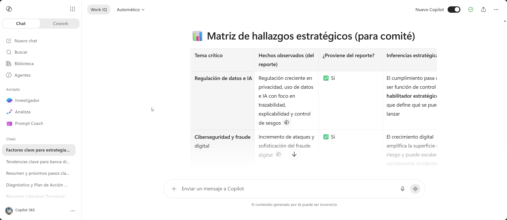
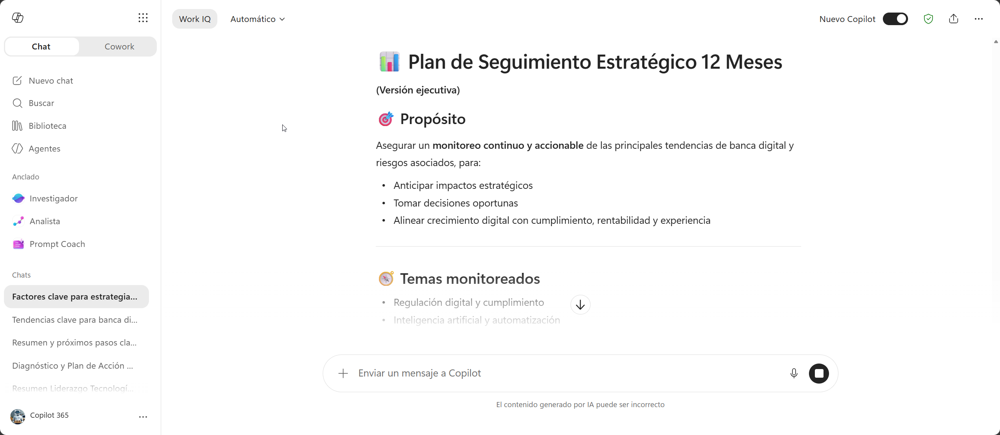
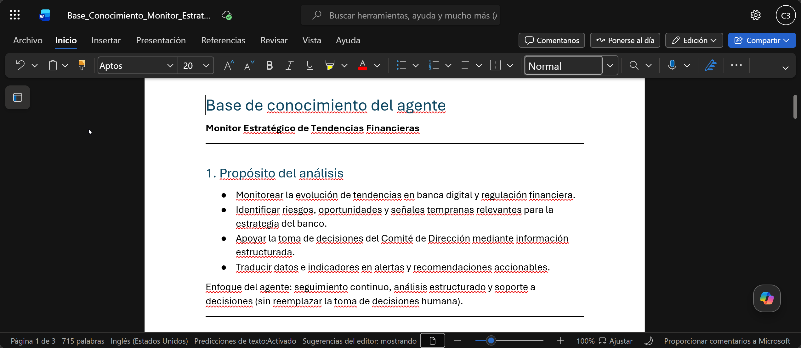

# Demostración 2. Consolidar hallazgos estratégicos y diseñar un plan de seguimiento ejecutivo

## Objetivo de la práctica:

Al finalizar la práctica, serás capaz de:

* Usar Microsoft 365 Copilot Chat para transformar un reporte de investigación en una matriz estratégica para dirección.
* Proponer indicadores de seguimiento para monitorear tendencias durante los próximos 12 meses.
* Preparar una base de conocimiento para un agente especializado que apoye al Comité de Dirección en la toma de decisiones estratégicas.
## Duración aproximada:

* 30 minutos.

## Tabla de ayuda:

| Elemento              | Valor de referencia                                            | Observaciones                                                                          |
| --------------------- | -------------------------------------------------------------- | -------------------------------------------------------------------------------------- |
| Aplicación principal  | Microsoft 365 Copilot Chat                                     | Usar modo Trabajo si se referencian documentos de OneDrive o SharePoint.               |
| Insumo requerido      | `Reporte_Investigacion_Tendencias_Banca_Digital.docx`          | Generado en la Demostración 1.                                                         |
| Insumo de continuidad | Agenda de investigación generada en la Demostración 1          | Permite validar que la matriz estratégica conserva la estructura del análisis inicial. |
| Material adicional    | `Criterios_Monitoreo_Estrategico_Demo.docx`                    | Ayuda a definir indicadores y semáforos ejecutivos.                                    |
| Salida esperada       | Matriz estratégica, plan de seguimiento y base de conocimiento | La base de conocimiento será usada para crear el agente en la Demostración 3.          |

## Contexto de la demostración

Después de recibir el reporte de investigación generado en la Demostración 1, el Comité de Dirección necesita pasar de la exploración a la acción. El objetivo de esta demostración es convertir los hallazgos del reporte en una matriz estratégica, definir riesgos y oportunidades, asignar áreas responsables y establecer un plan de seguimiento ejecutivo para los próximos 12 meses.

Esta demostración mantiene continuidad con el trabajo previo: la agenda de investigación sirvió como estructura para el análisis inicial, el reporte consolidó los hallazgos y ahora esos hallazgos se convierten en decisiones, indicadores y conocimiento reutilizable para un agente especializado.

## Instrucciones

### Tarea 1. Preparar los insumos para la consolidación estratégica.

**Paso 1.** Abrir Microsoft 365 Copilot Chat.

**Paso 2.** Iniciar un nuevo chat o continuar el chat de la demostración anterior.

**Paso 3.** Adjuntar o referenciar el reporte generado en la Demostración 1:

`Reporte_Investigacion_Tendencias_Banca_Digital.docx`

**Paso 4.** Si se guardó la agenda de investigación generada en la Demostración 1, adjuntarla o referenciarla también para conservar la trazabilidad entre preguntas, hallazgos y recomendaciones.

**Paso 5.** Adjuntar o referenciar el documento:

`Criterios_Monitoreo_Estrategico_Demo.docx`

> [!Nota]
> En esta demostración se usa Copilot Chat para consolidar y razonar sobre la información. El objetivo no es investigar más, sino estructurar una salida de decisión para dirección a partir de los hallazgos ya obtenidos.

---

### Tarea 2. Generar una matriz estratégica de riesgos y oportunidades.

**Paso 1.** Solicitar a Copilot una matriz estratégica basada en el reporte de investigación.

Prompt sugerido:

```text
Actúa como asesor estratégico del Comité de Dirección de un banco.

Con base en el reporte de investigación sobre tendencias de banca digital y regulación financiera, y respetando la estructura de la agenda de investigación, genera una matriz estratégica para la dirección.

La matriz debe incluir las columnas:
- Tendencia o tema.
- Categoría: estratégica, regulatoria, tecnológica, financiera u operativa.
- Hallazgo del reporte que sustenta el análisis.
- Oportunidad para el banco.
- Riesgo o amenaza.
- Área afectada.
- Impacto esperado.
- Urgencia.
- Recomendación ejecutiva.

Usa lenguaje claro, ejecutivo y orientado a toma de decisiones.
Diferencia hechos observados de inferencias o recomendaciones.
```

**Paso 2.** Revisar la matriz y pedir a Copilot que priorice los temas críticos.

Prompt sugerido:

```text
A partir de la matriz anterior, identifica los cinco temas más críticos que debería revisar el Comité de Dirección en los próximos 90 días.

Para cada tema, explica:
1. Por qué es prioritario.
2. Qué evidencia del reporte lo sustenta.
3. Qué decisión podría requerir.
4. Qué área debería liderar el seguimiento.
5. Qué riesgo existe si no se actúa.
```

**Paso 3.** Validar que Copilot diferencie hechos, inferencias y recomendaciones.

Prompt sugerido:

```text
Separa los hallazgos en tres grupos: hechos observados en la investigación, inferencias estratégicas y recomendaciones ejecutivas.

Presenta el resultado en una tabla clara para dirección e indica qué elementos provienen directamente del reporte y cuáles son interpretación estratégica.
```



---

### Tarea 3. Diseñar indicadores de monitoreo para 12 meses.

**Paso 1.** Solicitar a Copilot indicadores de seguimiento para monitorear la evolución de tendencias y regulación.

Prompt sugerido:

```text
Propón indicadores para monitorear durante los próximos 12 meses la evolución de las tendencias y riesgos identificados en la matriz estratégica.

Incluye indicadores para:
1. Regulación digital y cumplimiento.
2. Inteligencia artificial y agentes.
3. Pagos digitales e interoperabilidad.
4. Experiencia digital del cliente.
5. Resiliencia operativa y ciberseguridad.
6. Competencia y oportunidades de negocio.

Presenta una tabla con:
- Indicador.
- Definición.
- Tendencia o riesgo asociado.
- Frecuencia.
- Área responsable.
- Fuente sugerida.
- Semáforo.
- Decisión asociada.
```

**Paso 2.** Pedir a Copilot que convierta los indicadores en un plan de seguimiento ejecutivo.

Prompt sugerido:

```text
Convierte los indicadores anteriores en un plan de seguimiento ejecutivo de 12 meses.

Incluye:
- Ritual mensual de revisión.
- Revisión trimestral del radar de tendencias.
- Responsables por categoría.
- Mecanismo de escalamiento al Comité de Dirección.
- Entregables esperados.
- Criterios para semáforo rojo, amarillo y verde.
- Relación entre cada indicador y las decisiones que podría detonar.
```

**Paso 3.** Solicitar una versión de una página para dirección.

Prompt sugerido:

```text
Resume el plan de seguimiento en una versión ejecutiva de una página.

Debe incluir:
- Propósito.
- Temas monitoreados.
- Responsables.
- Indicadores clave.
- Frecuencia.
- Decisiones esperadas.
- Criterios de escalamiento al Comité de Dirección.
```



---

### Tarea 4. Preparar la base de conocimiento para el agente especializado.

**Paso 1.** Pedir a Copilot que genere un resumen listo para ser usado como conocimiento del agente.

Prompt sugerido:

```text
Prepara un resumen estructurado para usarlo como base de conocimiento de un agente especializado llamado “Monitor Estratégico de Tendencias Financieras”.

Este agente será creado en la siguiente demostración y debe usar como base el reporte de investigación, la matriz estratégica y el plan de seguimiento ejecutivo.

El resumen debe incluir:
1. Propósito del análisis.
2. Tendencias prioritarias.
3. Riesgos regulatorios y operativos.
4. Oportunidades de negocio.
5. Áreas afectadas.
6. Indicadores de seguimiento.
7. Preguntas frecuentes que el agente debería poder responder.
8. Límites del agente:
   - No emitir decisiones finales.
   - Diferenciar hechos de recomendaciones.
   - Escalar temas regulatorios a Legal y Cumplimiento.
   - Indicar cuando una respuesta requiere validación humana.
9. Fuentes internas que debería consultar o recibir como conocimiento.
```

**Paso 2.** Revisar que el resumen no incluya datos sensibles innecesarios, información no validada o decisiones finales que correspondan al Comité de Dirección.

**Paso 3.** Guardar el resultado con el nombre:

`Base_Conocimiento_Monitor_Estrategico_Tendencias`

**Paso 4.** Confirmar que el documento esté disponible en OneDrive o SharePoint para usarlo en Agent Builder durante la Demostración 3.



---

### Resultado esperado

Al finalizar la demostración, el instructor debe contar con una matriz estratégica, un plan de seguimiento ejecutivo y una base de conocimiento lista para crear el agente especializado en la Demostración 3.

| Elemento               | Resultado esperado                                                                              |
| ---------------------- | ----------------------------------------------------------------------------------------------- |
| Matriz estratégica     | Riesgos, oportunidades, áreas afectadas, evidencia del reporte y recomendaciones.               |
| Priorización ejecutiva | Cinco temas críticos para revisión en 90 días.                                                  |
| Indicadores            | Métricas para monitoreo de 12 meses.                                                            |
| Plan de seguimiento    | Ritual, responsables, semáforos, decisiones asociadas y escalamiento.                           |
| Base de conocimiento   | Documento listo para Agent Builder.                                                             |
| Continuidad            | Trazabilidad entre agenda de investigación, reporte, matriz estratégica y agente especializado. |

## Resumen del capítulo

* Consolidación estratégica del reporte de investigación generado en la Demostración 1.
* Uso de la agenda de investigación como referencia de continuidad.
* Creación de matriz de riesgos y oportunidades.
* Priorización de temas para el Comité de Dirección.
* Definición de indicadores de seguimiento de 12 meses.
* Preparación de base de conocimiento para un agente especializado en la Demostración 3.
