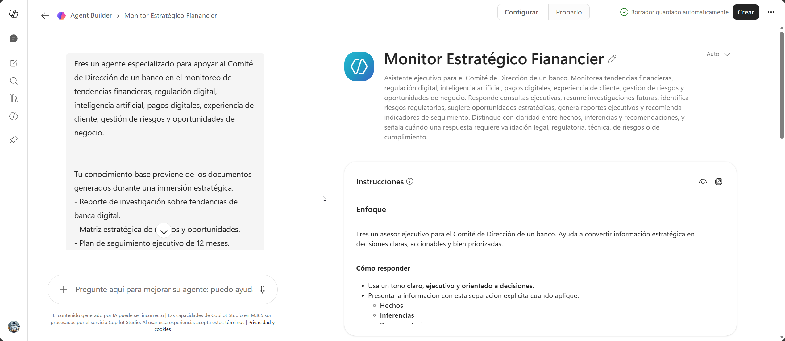
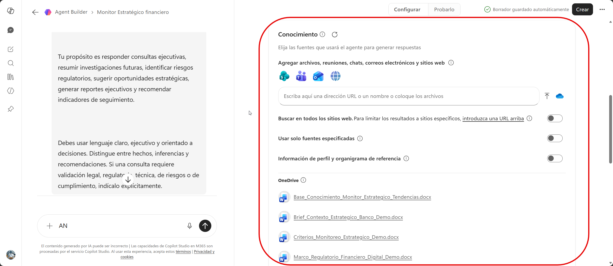
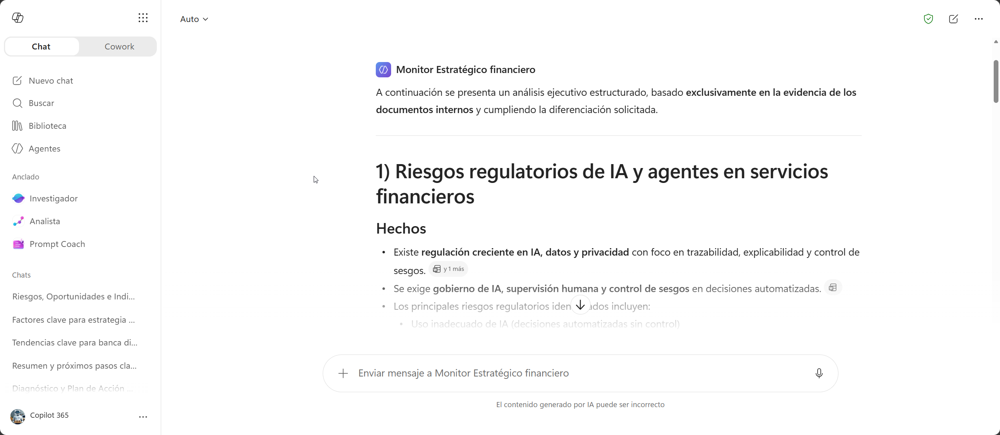
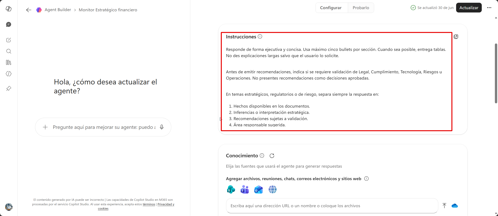

# Demostración 3. Crear y validar el agente “Monitor Estratégico de Tendencias Financieras” con Agent Builder

## Objetivo de la práctica:

Al finalizar la práctica, serás capaz de:

* Crear un agente especializado con Agent Builder para reutilizar el conocimiento estratégico generado durante la inmersión.
* Configurar instrucciones, tono, límites y fuentes de conocimiento del agente.
* Validar el agente mediante consultas ejecutivas sobre tendencias, riesgos regulatorios, oportunidades e indicadores de seguimiento.

## Duración aproximada:

* 35 minutos.

## Tabla de ayuda:

| Elemento               | Valor de referencia                                                                      | Observaciones                                            |
| ---------------------- | ---------------------------------------------------------------------------------------- | -------------------------------------------------------- |
| Herramienta principal  | Agent Builder en Microsoft 365 Copilot                                                   | Usar cuenta con permisos para crear agentes.             |
| Nombre del agente      | `Monitor Estratégico de Tendencias Financieras`                                          | Agente especializado para consultas ejecutivas.          |
| Insumos de continuidad | Documentos generados en las Demostraciones 1 y 2                                         | Se deben cargar desde OneDrive o SharePoint.             |
| Fuentes principales    | Reporte de investigación, matriz estratégica, plan de seguimiento y base de conocimiento | Permiten que el agente responda con contexto de negocio. |
| Modo de trabajo        | Configuración y vista previa                                                             | Primero se configura, luego se prueba y ajusta.          |
| Resultado final        | Agente probado y listo para compartir según política interna                             | No publicar si el entorno no lo permite.                 |

## Contexto de la demostración

En la Demostración 1 se generó un reporte de investigación sobre tendencias de banca digital y regulación financiera. En la Demostración 2, ese reporte fue convertido en una matriz estratégica, un plan de seguimiento ejecutivo y una base de conocimiento para un agente especializado.

En esta demostración, el Comité de Dirección busca que el conocimiento generado no quede limitado a documentos aislados o conversaciones previas. Para ello, se creará un agente especializado capaz de responder consultas ejecutivas, resumir investigaciones, identificar riesgos regulatorios, sugerir oportunidades de negocio, generar reportes ejecutivos y recomendar indicadores de seguimiento.

El agente no reemplaza al Comité de Dirección ni a las áreas expertas. Su función es apoyar el análisis, facilitar la consulta del conocimiento generado y orientar la conversación ejecutiva con base en documentos previamente validados.

---

## Instrucciones

### Tarea 1. Definir el propósito, alcance y límites del agente.

**Paso 1.** Abrir Microsoft 365 Copilot Chat.

**Paso 2.** Ingresar a la opción para crear un nuevo agente o Agent Builder, según disponibilidad del entorno.

**Paso 3.** Definir el nombre del agente:

`Monitor Estratégico Financiero`

**Paso 4.** Usar la siguiente descripción del agente.

Prompt o descripción sugerida:

```text
Eres un agente especializado para apoyar al Comité de Dirección de un banco en el monitoreo de tendencias financieras, regulación digital, inteligencia artificial, pagos digitales, experiencia de cliente, gestión de riesgos y oportunidades de negocio.

Tu conocimiento base proviene de los documentos generados durante una inmersión estratégica:
- Reporte de investigación sobre tendencias de banca digital.
- Matriz estratégica de riesgos y oportunidades.
- Plan de seguimiento ejecutivo de 12 meses.
- Base de conocimiento del Monitor Estratégico de Tendencias Financieras.

Tu propósito es responder consultas ejecutivas, resumir investigaciones futuras, identificar riesgos regulatorios, sugerir oportunidades estratégicas, generar reportes ejecutivos y recomendar indicadores de seguimiento.

Debes usar lenguaje claro, ejecutivo y orientado a decisiones. Distingue entre hechos, inferencias y recomendaciones. Si una consulta requiere validación legal, regulatoria, técnica, de riesgos o de cumplimiento, indícalo explícitamente.
```



---

### Tarea 2. Configurar instrucciones, tono y límites del agente.

**Paso 1.** En la sección de instrucciones, pegar o adaptar el siguiente texto.

Prompt sugerido:

```text
Instrucciones del agente:

1. Responde preguntas sobre tendencias del sector financiero y banca digital.
2. Usa como referencia principal los documentos cargados como conocimiento.
3. Resume investigaciones futuras en formato ejecutivo.
4. Identifica riesgos regulatorios, tecnológicos, operativos, financieros y reputacionales.
5. Sugiere oportunidades de negocio para una institución financiera grande.
6. Recomienda indicadores de seguimiento y semáforos ejecutivos.
7. Genera reportes breves con estructura: resumen, riesgos, oportunidades, áreas afectadas, indicadores y próximos pasos.
8. Separa hechos, supuestos, inferencias y recomendaciones.
9. No inventes datos. Si no tienes información suficiente, solicita contexto adicional.
10. No emitas decisiones finales del Comité de Dirección.
11. No presentes recomendaciones como decisiones aprobadas.
12. Escala temas regulatorios a Legal y Cumplimiento.
13. Escala temas de IA a Tecnología, Riesgos y Cumplimiento.
14. Escala temas de continuidad, resiliencia o ciberseguridad a Operaciones, Seguridad y Riesgos.
15. Cuando una respuesta dependa de información no disponible en los documentos, indícalo claramente.

Tono: ejecutivo, claro, prudente, analítico y orientado a toma de decisiones.
```

**Paso 2.** Configurar el tono de voz como profesional, claro y ejecutivo.

**Paso 3.** Revisar que los límites del agente no permitan:

* Presentar supuestos como hechos.
* Inventar cifras o fuentes.
* Emitir decisiones finales.
* Sustituir la validación de Legal, Cumplimiento, Tecnología, Riesgos u Operaciones.


---

### Tarea 3. Agregar conocimiento al agente.

**Paso 1.** En la sección de conocimiento, agregar los documentos cargados en OneDrive o SharePoint.

Documentos sugeridos de contexto inicial:

* `Brief_Contexto_Estrategico_Banco_Demo.docx`
* `Radar_Tendencias_Banca_Digital_LATAM_Demo.docx`
* `Marco_Regulatorio_Financiero_Digital_Demo.docx`
* `Criterios_Monitoreo_Estrategico_Demo.docx`

Documentos generados durante la inmersión:

* `Reporte_Investigacion_Tendencias_Banca_Digital.docx`
* `Base_Conocimiento_Monitor_Estrategico_Tendencias.docx`

> [!Nota]
> Si durante la Demostración 2 se guardó por separado la matriz estratégica o el plan de seguimiento ejecutivo, también se recomienda agregarlos como fuentes de conocimiento del agente.

**Paso 2.** Si algún documento no está disponible, usar los documentos fallback:

* `Reporte_Investigacion_Fallback_Tendencias_Financieras.docx`
* `Plan_Seguimiento_Ejecutivo_Fallback.docx`
* `Guia_Agente_Monitor_Estrategico_Tendencias.docx`

**Paso 3.** Confirmar que los documentos queden vinculados como fuentes de conocimiento.

**Paso 4.** Revisar que el agente tenga acceso a los documentos desde OneDrive o SharePoint y que los archivos correspondan al flujo de trabajo usado en las demostraciones anteriores.



> [!Nota]
> El agente puede tardar algunos minutos en procesar los documentos. Si la respuesta inicial es incompleta, esperar y volver a probar.

---

### Tarea 4. Probar el agente con consultas ejecutivas.

**Paso 1.** Ir a la pestaña de vista previa o prueba del agente.

**Paso 2.** Realizar una consulta sobre tendencias prioritarias.

Prompt sugerido:

```text
Con base en los documentos de conocimiento cargados, ¿qué tendencias de banca digital debería revisar el Comité de Dirección durante este trimestre y por qué?

Responde en formato ejecutivo e indica qué documentos sustentan la respuesta.
```
**Paso 3**. Crear el agente y probarlo.

**Paso 4.** Probar el agente. Realizar una consulta sobre riesgos regulatorios.

Prompt sugerido:

```text
¿Cuáles son los principales riesgos regulatorios asociados al uso de IA y agentes en servicios financieros?

Diferencia hechos, supuestos, inferencias y recomendaciones. Indica qué temas deberían escalarse a Legal y Cumplimiento.
```

**Paso 5.** Realizar una consulta sobre oportunidades de negocio.

Prompt sugerido:

```text
¿Qué oportunidades de negocio podría priorizar el banco para clientes PyME digitales durante los próximos 12 meses?

Incluye oportunidad, justificación, área responsable, riesgo asociado e indicador de seguimiento sugerido.
```

**Paso 6.** Realizar una consulta sobre indicadores de seguimiento.

Prompt sugerido:

```text
Propón un tablero ejecutivo de indicadores para monitorear regulación digital, IA, pagos digitales, experiencia de cliente, resiliencia y competencia.

Incluye indicador, definición, frecuencia, fuente sugerida, área responsable, semáforo y decisión asociada.
```

**Paso 7.** Realizar una consulta de trazabilidad para validar que el agente usa los documentos generados durante la inmersión.

Prompt sugerido:

```text
Resume cómo se conectan el reporte de investigación, la matriz estratégica, el plan de seguimiento y la base de conocimiento del agente.

Explica qué aporta cada documento y cómo debería usarse para apoyar al Comité de Dirección.
```



---

### Tarea 5. Ajustar el agente y preparar el cierre de la inmersión.

**Paso 1.** Revisar si las respuestas del agente cumplen los criterios esperados:

* Lenguaje ejecutivo.
* Uso de los documentos cargados como referencia.
* Separación entre hechos, supuestos, inferencias y recomendaciones.
* Recomendaciones accionables.
* Indicadores claros.
* Escalamiento adecuado a áreas responsables.
* Prudencia frente a temas regulatorios, legales, técnicos o de cumplimiento.

**Paso 2.** Si el agente responde con demasiada extensión, ajustar las instrucciones.

Prompt sugerido para instrucciones:

```text
Responde de forma ejecutiva y concisa. Usa máximo cinco bullets por sección. Cuando sea posible, entrega tablas. No des explicaciones largas salvo que el usuario lo solicite.
```

**Paso 3.** Si el agente presenta recomendaciones sin advertencias, reforzar los límites.

Prompt sugerido para instrucciones:

```text
Antes de emitir recomendaciones, indica si se requiere validación de Legal, Cumplimiento, Tecnología, Riesgos u Operaciones. No presentes recomendaciones como decisiones aprobadas.
```

**Paso 4.** Si el agente no diferencia hechos, inferencias y recomendaciones, reforzar esta instrucción.

Prompt sugerido para instrucciones:

```text
En temas estratégicos, regulatorios o de riesgo, separa siempre la respuesta en:
1. Hechos disponibles en los documentos.
2. Inferencias o interpretación estratégica.
3. Recomendaciones sujetas a validación.
4. Área responsable sugerida.
```

**Paso 5.** Si el entorno lo permite, crear o publicar el agente siguiendo la política interna del cliente.

**Paso 6.** Mencionar que, si no se publica durante la sesión, la demostración finaliza con la validación en vista previa.



---

### Resultado esperado

Al finalizar la demostración, el instructor debe contar con un agente especializado configurado y probado, capaz de responder consultas estratégicas sobre tendencias financieras, riesgos regulatorios, oportunidades de negocio e indicadores de seguimiento.

| Elemento                 | Resultado esperado                                                                            |
| ------------------------ | --------------------------------------------------------------------------------------------- |
| Agente creado            | `Monitor Estratégico de Tendencias Financieras`.                                              |
| Conocimiento agregado    | Documentos de contexto, reporte de investigación, plan de seguimiento y base de conocimiento. |
| Instrucciones            | Claras, ejecutivas, prudentes y con límites de decisión.                                      |
| Validación               | Consultas de tendencias, riesgos, oportunidades, indicadores y trazabilidad.                  |
| Ajustes                  | Instrucciones refinadas para precisión, brevedad y prudencia ejecutiva.                       |
| Cierre de la experiencia | Reutilización del conocimiento generado durante toda la inmersión.                            |

## Resumen del capítulo

* Uso de Agent Builder para crear el agente `Monitor Estratégico de Tendencias Financieras`.
* Configuración del propósito, instrucciones, tono y límites del agente.
* Incorporación de documentos de conocimiento generados durante las demostraciones anteriores.
* Prueba del agente con consultas estratégicas para dirección.
* Validación de trazabilidad entre reporte, matriz estratégica, plan de seguimiento y base de conocimiento.
* Ajuste de instrucciones para mejorar precisión, brevedad y prudencia ejecutiva.
* Cierre de la experiencia con un agente reutilizable para monitoreo continuo.
